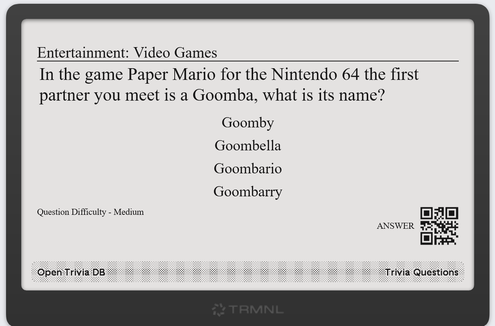

# TRMNL Open Trivia DB




A Plugin for the TRMNL device (https://usetrmnl.com/) that display Trivia Questions and Answer (via QR code) from Open Trivia DB (https://opentdb.com/)

## Starting The Preview

- Tested / Previewed using trmnlp (https://github.com/usetrmnl/trmnlp)
- Requires Ruby 3.x to be installed

### Setup & run

- clone repo
- In terminal
  - cd to root directory of repo
  - run:
    ```
    gem install trmnl_preview
    trmnlp serve
    ```

## Create Private Plugin of this

You can create your own Private Plugin in Trmnl if you like (I might submit as a Recipe/community in future so the below will not be needed).

### Private Plugin Install Steps

- Go to https://usetrmnl.com/plugins, Search Plugins "Private Plugins", click "Add New"

  - For Strategy select "Polling"
  - For Polling URL(s) from the code folder src/settings.yml, copy the URL

  ```text
  https://opentdb.com/api.php?amount=1&category={{category}}&difficulty={{difficulty}}

  ```

  - Skip to Form Fields section (allows options for category & question difficulty) and copy & paste from code folder file `src/settings.yml` section under
    ` custom_fields:`
  - Leave rest default and at the top right of the page give it a Name like
    `Open Trivia DB`
    Then hit `save` button
  - Now at the top right click
    `Edit Markup`
  - You will now have 4 Tabs `Full `, `Half horizontal`, `Half vertical`, `Quadrant`
  - Copy the code content from each of the files with the same names under `src/` into each of these sections.
  - Hit `save` then top left `Back to plugin settings` should display the plugin screen, if not
  - Search for `Force Refresh` on the page and click `Click Here` to force a refresh to display
  - You can also now change the `Refresh rate` to like every 15 minutes or whatever you like

## Enjoy!

Made for my friend Josh, the Trivia Master
